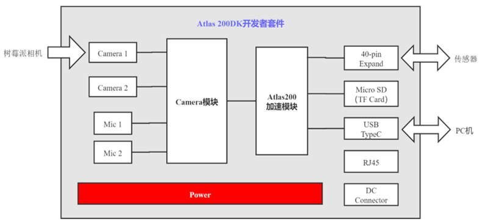

# Face recognition entrance guard

基于Atlas200DK的智能门禁系统，利用Ascend310 AI处理器的强大算力和Hi3559芯片的图像处理优势，对摄像头的实时画面进行人脸识别和体温检测，进而自动实现门禁控制与异常报警功能。

1. 项目分为管理系统和门禁设备系统两部分，管理系统：[access-control-system](https://github.com/zhangjunhui6/access-control-system)
2. 门禁设备系统包括开发板上基于ACL的C++模型推理应用和开发主机上基于Tornado+Bootstrap的Web应用
3. 相比传统人脸识别门禁系统，本系统具有响应速度更快、传输更安全可靠、满足疫情防控需要等优点

## 系统功能

## 硬件结构

## 目录结构

'''bash
├─inc       # 模型推理、外设控制、图像处理的头文件
├─model     # Ascend模型
├─out       # 可执行文件
├─presenter-agent     # 向主机传输数据的代理
│  ├─include
│  ├─proto  # protobuf
│  └─src
├─presenter-server    # web 应用
│  └─facial_recognition   
├─script    # 配置文件+脚本文件夹
├─src       
└─static    # 静态文件存放目录
'''

